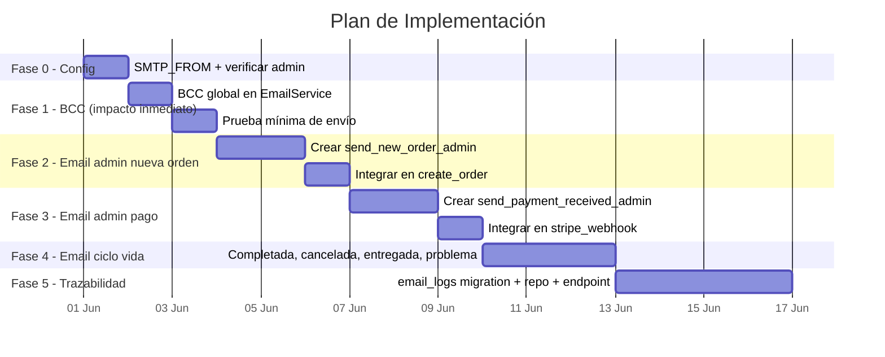

# Plan de Correcciones: Notificaciones Email

**Fecha:** 2026-05-31
**Basado en:** `sistema-notificaciones-email-2026-05-31.md` (verificado contra código fuente)
**Estado:** Pendiente de implementación

---

## 0. Verificación del Documento

Cada afirmación del documento `sistema-notificaciones-email-2026-05-31.md` fue cotejada contra el código real:

| Afirmación | ¿Correcta? | Evidencia |
|-----------|:----------:|-----------|
| SMTP Brevo configurado | ✅ | `.env:104-108` — `GLORY_SMTP_HOST=smtp-relay.brevo.com` |
| Email confirmación al cliente al crear pedido | ✅ | `src/handlers/orders.rs:124-143` — llama `send_order_confirmation` |
| NO hay email al admin al crear pedido | ✅ | `src/handlers/orders.rs:111-143` — solo in-app, sin email a admin |
| NO hay email al admin en pago recibido | ✅ | `src/handlers/payments.rs:160-280` — webhook sin email a admin |
| `send_escalation_emails` existe | ✅ | `src/services/email.rs:178-227` |
| `send_vps_pending_approval` existe | ✅ | `src/services/email.rs:325-361` |
| `send_chat_invoice_paid_admin` existe | ✅ | `src/services/email.rs:278-319` |
| `SMTP_FROM` no configurado | ✅ | `.env` no tiene `SMTP_FROM`; código usa `user.clone()` como fallback |
| No hay tabla `email_logs` | ✅ | Ninguna migración SQL la crea; no existe en BD |
| `admin_emails()` existe en user repo | ✅ | `src/repositories/user.rs:437-445` — `SELECT email FROM users WHERE role = 'admin' AND status = 'active'` |
| `on_invoice_paid` no verifica `cancelled` | ✅ | `src/services/hosting_stripe.rs:516` — `if hosting.status != "active"` reactiva sin excluir cancelled |

**Veredicto: El documento es preciso.** No se encontraron discrepancias.

---

## 1. Correcciones a Implementar

### Fase 0 — Configuración (5 min)

| # | Acción | Archivo | Código |
|---|--------|---------|--------|
| 0.1 | Agregar `SMTP_FROM` al `.env` | `.env` | `SMTP_FROM=noreply@nakomi.studio` |
| 0.2 | Verificar admin existe en BD | (consulta manual) | `SELECT email, role, status FROM users WHERE email = 'andoryyu@gmail.com'` |

### Fase 1 — BCC global en EmailService::send() (30 min)

| # | Acción | Archivo | Código |
|---|--------|---------|--------|
| 1.1 | Añadir BCC a `andoryyu@gmail.com` | `src/services/email.rs:58-77` | Agregar `.bcc("andoryyu@gmail.com".parse().map_err(...)?)` en `Message::builder()` |
| 1.2 | Verificar compilación | terminal | `cargo check` |
| 1.3 | Prueba mínima (ver sección 3) | — | Enviar correo de prueba |

**Impacto de Fase 1:** Todo correo que salga de la plataforma (confirmación a cliente, escalación, VPS, etc.) llegará también como BCC a `andoryyu@gmail.com`. Esto da visibilidad inmediata sin tocar ningún handler.

### Fase 2 — Email al admin en nueva orden (1h)

| # | Acción | Archivo | Código |
|---|--------|---------|--------|
| 2.1 | Crear `send_new_order_admin()` | `src/services/email.rs` | Nueva función siguiendo patrón de `send_escalation_emails` (recibe `admin_emails &[String]`) |
| 2.2 | Template HTML | `src/services/email.rs` | Similar a `send_order_confirmation` pero dirigido a admin: "Nuevo pedido: #N, Servicio X, Plan Y, $Z, Cliente: email" |
| 2.3 | Llamar desde `create_order()` | `src/handlers/orders.rs:124-143` | Después del email al cliente, añadir bloque idéntico al de escalación: `admin_emails()` + `send_new_order_admin()` |
| 2.4 | Verificar compilación | terminal | `cargo check` |

### Fase 3 — Email al admin en pago recibido (1h)

| # | Acción | Archivo | Código |
|---|--------|---------|--------|
| 3.1 | Crear `send_payment_received_admin()` | `src/services/email.rs` | Template: "💰 Pago recibido: Orden #N, $X.XX, Cliente: email" |
| 3.2 | Llamar desde `stripe_webhook()` | `src/handlers/payments.rs:160-280` | En el bloque `payment_intent.succeeded`, después de notificar al cliente, añadir email a admin |
| 3.3 | Verificar compilación | terminal | `cargo check` |

### Fase 4 — Email al cliente en eventos del ciclo de vida (2h)

| # | Acción | Archivo | Código |
|---|--------|---------|--------|
| 4.1 | Email "Orden completada" al cliente | `src/handlers/order_lifecycle.rs` | Cuando `order.status = completed`, enviar `send_order_completed_client()` |
| 4.2 | Email "Orden cancelada" al cliente | `src/handlers/order_lifecycle.rs` | Cuando se cancela, enviar `send_order_cancelled_client()` con razón |
| 4.3 | Email "Fase entregada" al cliente | `src/handlers/deliverables.rs` | Cuando se entrega fase, enviar `send_phase_delivered_client()` |
| 4.4 | Email "Problema reportado" al cliente | `src/handlers/problems.rs` | Acuse de recibo al cliente |
| 4.5 | Verificar compilación | terminal | `cargo check` |

### Fase 5 — Trazabilidad (email_logs) (3h)

| # | Acción | Archivo |
|---|--------|---------|
| 5.1 | Crear migración SQL | `migrations/20260531000000_email_logs.up.sql` |
| 5.2 | Crear repositorio | `src/repositories/email_log.rs` |
| 5.3 | Integrar logging en `EmailService::send()` | `src/services/email.rs` — log no-fatal |
| 5.4 | Exponer endpoint admin | `src/handlers/admin_email_logs.rs` |

---

## 2. Orden de Implementación Recomendado



---

## 3. Plan de Prueba Mínima (antes de tocar código)

### 3.1 Prerrequisitos

```powershell
# 1. Verificar que SMTP está configurado correctamente
cd C:\Users\Owner\OneDrive\Documentos\glory-rust-template
Get-Content .env | Select-String "SMTP|GLORY_SMTP"

# 2. Verificar que andoryyu@gmail.com existe como admin en la BD
#    (conectarse a la BD local y ejecutar)
psql -U postgres -d glory_rust_template -c "SELECT email, role, status FROM users WHERE email = 'andoryyu@gmail.com';"

# 3. Si NO existe, crearlo:
psql -U postgres -d glory_rust_template -c "
INSERT INTO users (id, email, password_hash, role, status, username, created_at)
VALUES (gen_random_uuid(), 'andoryyu@gmail.com', '', 'admin', 'active', 'andoryyu', NOW())
ON CONFLICT (email) DO UPDATE SET role = 'admin', status = 'active';
"
```

### 3.2 Prueba 1: Envío directo desde Rust (unit test)

**Opción A — Script de prueba rápida (recomendada):**

Crear un binario de prueba temporal que use `EmailService::send()` directamente:

```rust
// scripts/test_email.rs
#[tokio::main]
async fn main() {
    let config = EmailConfig::from_env().expect("SMTP no configurado");
    println!("Enviando correo de prueba a andoryyu@gmail.com...");
    EmailService::send(
        &config,
        "andoryyu@gmail.com",
        "🧪 Prueba SMTP — Nakomi Studio",
        "<h1>Prueba</h1><p>Si ves esto, SMTP funciona correctamente.</p>",
    ).await.expect("Error enviando email");
    println!("✅ Correo enviado. Revisa tu bandeja.");
}
```

Ejecutar con:
```powershell
cargo run --example test_email
# O directamente:
cargo test --test test_smtp_connection
```

**Opción B — Usar curl para probar SMTP Brevo directamente:**
```powershell
# Probar conexión SMTP con openssl (verifica que el servidor responde)
openssl s_client -starttls smtp -connect smtp-relay.brevo.com:587 -crlf
```

### 3.3 Prueba 2: Usar el bypass checkout de prueba

Si hay un email en `GLORY_TEST_CHECKOUT_EMAILS`:

1. Crear una orden como usuario de prueba
2. El sistema enviará `send_order_confirmation` al cliente
3. Con Fase 1 (BCC), `andoryyu@gmail.com` recibirá copia

### 3.4 Prueba 3: Verificación en Brevo

1. Ir a [Brevo Transactional Logs](https://app.brevo.com/transactional/logs)
2. Buscar por destinatario `andoryyu@gmail.com`
3. Verificar que el correo aparece como "Delivered"

### 3.5 Criterios de éxito

| Paso | Resultado esperado | Cómo verificarlo |
|------|-------------------|------------------|
| Prueba 1 | Email llega a andoryyu@gmail.com en <30s | Revisar bandeja de entrada (y spam) |
| `cargo check` | Compilación exitosa | Terminal sin errores |
| BCC implementado | Todo correo existente llega también a andoryyu | Crear orden como test → ver correo duplicado en Brevo logs |

---

## ⚠️ Nota: Solo Local — Sin Commit ni Deploy

**Todo el trabajo aquí es LOCAL.** No se realiza ningún commit, push o deploy hasta que el usuario lo autorice explícitamente. Los cambios se ejecutan y validan en entorno local únicamente.

---

## 4. Resumen de Cambios por Archivo

| Archivo | Cambio | Prioridad |
|---------|--------|-----------|
| `.env` | Agregar `SMTP_FROM=noreply@nakomi.studio` | P0 |
| `src/services/email.rs` | BCC global + 4 nuevas funciones (`send_new_order_admin`, `send_payment_received_admin`, etc.) | P0 |
| `src/handlers/orders.rs` | Llamar `send_new_order_admin` después del email al cliente | P0 |
| `src/handlers/payments.rs` | Llamar `send_payment_received_admin` en webhook exitoso | P0 |
| `src/handlers/order_lifecycle.rs` | Llamar emails al completar/cancelar | P1 |
| `src/handlers/deliverables.rs` | Llamar email al entregar fase | P1 |
| `src/handlers/problems.rs` | Llamar email de acuse al cliente | P1 |
| `migrations/20260531000000_email_logs.up.sql` | Nueva tabla `email_logs` | P2 |
| `src/repositories/email_log.rs` | Nuevo repositorio | P2 |
| `src/handlers/admin_email_logs.rs` | Nuevo handler admin | P2 |

---

*Plan generado el 2026-05-31. Basado en verificación contra código fuente.*
