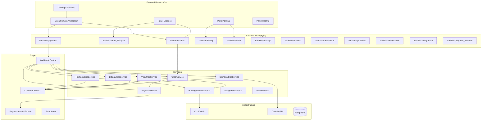
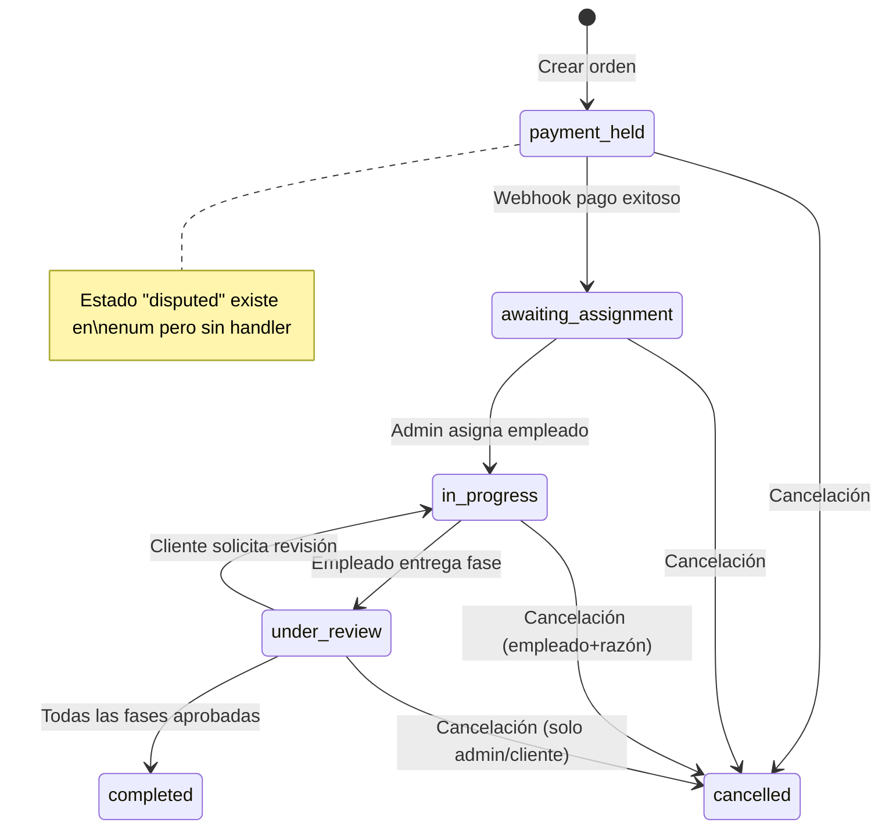
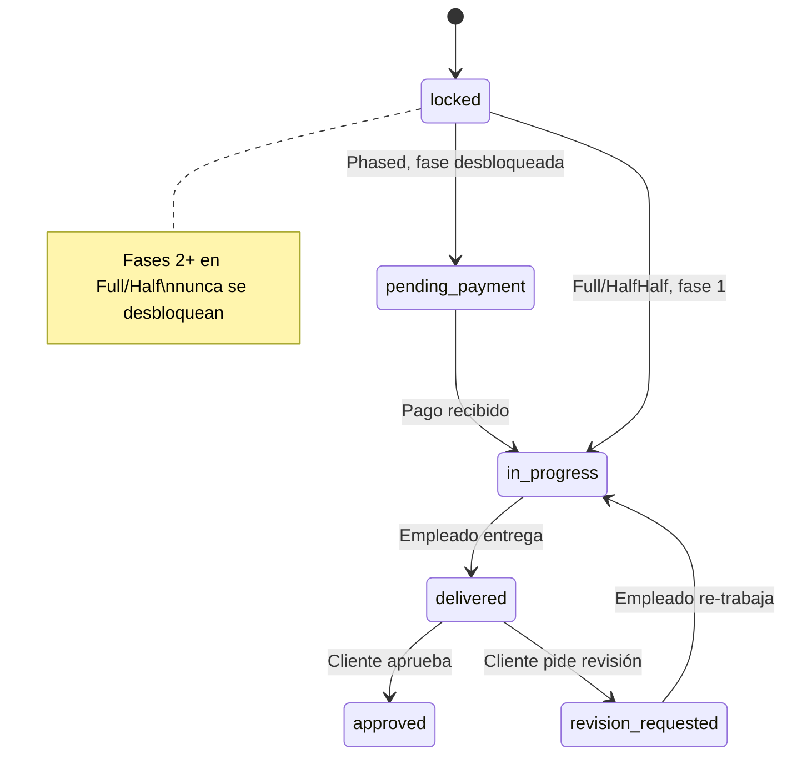
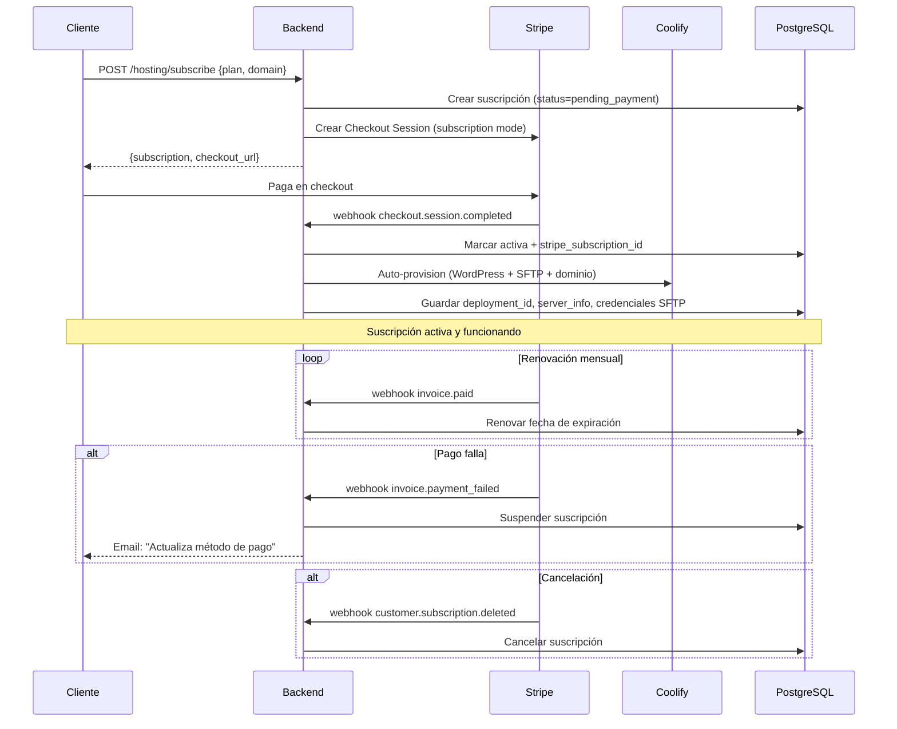

# Revisión Profunda: Contratación de Servicios

**Fecha:** 2026-05-31
**Alcance:** Flujo completo de compra → pago → ejecución → aprobación de servicios (órdenes, hosting, VPS, dominios, billing legacy, wallet).
**Tipo:** Revisión arquitectónica y funcional — sin modificaciones de código.

---

## Índice

1. [Mapa General del Sistema](#1-mapa-general-del-sistema)
2. [Ciclo de Vida de una Orden (Servicios por Proyecto)](#2-ciclo-de-vida-de-una-orden)
3. [Ciclo de Vida de Hosting](#3-ciclo-de-vida-de-hosting)
4. [Ciclo de Vida de VPS](#4-ciclo-de-vida-de-vps)
5. [Ciclo de Vida de Dominios](#5-ciclo-de-vida-de-dominios)
6. [Billing Legacy (Cobros Pendientes)](#6-billing-legacy)
7. [Wallet y Comisiones](#7-wallet-y-comisiones)
8. [Todos los Endpoints API](#8-todos-los-endpoints-api)
9. [Métodos de Pago Soportados](#9-métodos-de-pago-soportados)
10. [Frontend vs Backend — Cobertura UI](#10-frontend-vs-backend)
11. [Problemas Detectados](#11-problemas-detectados)
12. [Gaps y Huecos por Rellenar](#12-gaps-y-huecos-por-rellenar)
13. [Inconsistencias Técnicas](#13-inconsistencias-técnicas)
14. [Seguridad](#14-seguridad)
15. [Recomendaciones por Prioridad](#15-recomendaciones-por-prioridad)

---

## 1. Mapa General del Sistema

El sistema de contratación está compuesto por **5 dominios** independientes que comparten infraestructura de pagos (Stripe) y un webhook centralizado:



### Stack tecnológico

| Capa | Tecnología |
|------|-----------|
| Backend | Rust + Axum + SQLx + tokio |
| Frontend | React 18 + Vite 5 + TypeScript |
| State | Zustand + TanStack React Query |
| Pagos | Stripe (PaymentIntent, Checkout, Webhooks) |
| UI | Shadcn/ui + Tailwind CSS |
| Codegen | Orval (tags-split) |
| Infra | Coolify + Docker + PostgreSQL |
| Auth | JWT con roles (Admin/Employee/Client) |

---

## 2. Ciclo de Vida de una Orden

### 2.1 Estados



### 2.2 Estados de fases



### 2.3 Flujo detallado

| Paso | Acción | Endpoint | Quién |
|------|--------|----------|-------|
| 1 | Crear orden | `POST /api/orders` | Cliente/Admin |
| 2 | Describir proyecto | `PATCH /api/orders/:id/project-description` | Cliente/Admin |
| 3 | Pagar | `POST /api/orders/:id/pay` | Cliente/Admin |
| 4 | Webhook confirma pago | `POST /api/webhooks/stripe` | Stripe |
| 5 | Asignar empleado | `PUT /api/orders/:id/assign/:eid` | Admin |
| 6 | Definir fases (phased) | `PATCH /api/orders/:id/phases/:n` | Empleado/Admin |
| 7 | Agregar fases (phased) | `POST /api/orders/:id/phases` | Empleado/Admin |
| 8 | Eliminar fase locked | `DELETE /api/orders/:id/phases/:n` | Empleado/Admin |
| 9 | Entregar fase | `POST /api/orders/:id/phases/:n/deliver` | Empleado/Admin |
| 10 | Aprobar fase | `PUT /api/orders/:id/phases/:n/approve` | Cliente/Admin |
| 11 | Solicitar revisión | `PUT /api/orders/:id/phases/:n/revision` | Cliente/Admin |
| 12 | Cancelar | `POST /api/orders/:id/cancel` | Cualquier participante |
| 13 | Solicitar cancelación bilateral | `POST /api/orders/:id/cancel-request` | Cliente/Empleado |
| 14 | Responder cancelación | `POST /api/orders/:id/cancel-request/:rid/respond` | Parte contraria |
| 15 | Reportar problema | `POST /api/orders/:id/report-problem` | Cliente/Empleado |
| 16 | Solicitar reembolso | `POST /api/orders/:id/refund` | Cliente |
| 17 | Aprobar reembolso | `PATCH /api/refunds/:id` | Admin |
| 18 | Toggle IA intermediaria | `PUT /api/orders/:id/ai-intermediary` | Admin/Empleado |
| 19 | Ver actividad | `GET /api/orders/:id/activity` | Con acceso |
| 20 | Ver pagos | `GET /api/orders/:id/payments` | Con acceso |

### 2.4 Modos de pago

| Modo | Descuento | Estructura de pagos | Fases |
|------|-----------|-------------------|-------|
| **Full** | 20% | 1 pago total (PaymentIntent) | Fase 1 in_progress, resto locked |
| **HalfHalf** | 10% | 2 pagos de 50% | Fase 1 in_progress, resto locked |
| **Phased** | 0% | 1 pago por fase | Cada fase: pending_payment → in_progress |

### 2.5 Comisiones

Al completar una orden:
- **90%** → Wallet del empleado
- **10%** → Wallet de la plataforma (Nakomi)
- Créditos retirables después de **7 días** (anti-fraude)

---

## 3. Ciclo de Vida de Hosting



### 3.1 Endpoints de Hosting (~35 rutas)

| Método | Ruta | Auth | Descripción |
|--------|------|------|-------------|
| `POST` | `/hosting/subscribe` | Client | Self-service: contratar |
| `POST` | `/hosting/subscriptions` | Admin | Crear manual |
| `GET` | `/hosting/subscriptions` | Any | Listar suscripciones |
| `GET` | `/hosting/subscriptions/:id` | Any | Detalle |
| `PUT` | `/hosting/subscriptions/:id` | Admin | Actualizar plan/dominio |
| `DELETE` | `/hosting/subscriptions/:id` | Admin | Eliminar |
| `PATCH` | `/hosting/subscriptions/:id/status` | Admin | Cambiar estado |
| `POST` | `/hosting/subscriptions/:id/checkout` | Client | Crear checkout Stripe |
| `POST` | `/hosting/subscriptions/:id/provision` | Admin | Provisionar en Coolify |
| `POST` | `/hosting/subscriptions/:id/refresh` | Admin | Refrescar estado |
| `POST` | `/hosting/subscriptions/:id/restart` | Admin | Reiniciar |
| `POST` | `/hosting/subscriptions/:id/stop` | Admin | Detener |
| `POST` | `/hosting/subscriptions/:id/start` | Admin | Iniciar |
| `POST` | `/hosting/subscriptions/:id/rotate-credentials` | Admin | Rotar SFTP/wp-admin |
| `POST` | `/hosting/subscriptions/:id/verify-domain` | Admin | Verificar DNS |
| `GET` | `/hosting/subscriptions/:id/dns-check` | Admin | Check DNS records |
| `POST` | `/hosting/subscriptions/:id/cancel` | Client | Solicitar cancelación |
| `GET` | `/hosting/subscriptions/:id/backups` | Admin | Listar backups |
| `POST` | `/hosting/subscriptions/:id/backups` | Admin | Crear backup |
| `DELETE` | `/hosting/subscriptions/:id/backups/:bid` | Admin | Eliminar backup |
| `POST` | `/hosting/subscriptions/:id/restore` | Admin | Restaurar backup |
| `GET` | `/hosting/subscriptions/:id/stats` | Admin | Estadísticas (CPU, RAM, disco) |
| `GET` | `/hosting/subscriptions/:id/events` | Admin | Historial de eventos |
| `GET` | `/hosting/subscriptions/:id/email/aliases` | Admin | Listar alias email |
| `POST` | `/hosting/subscriptions/:id/email/aliases` | Admin | Crear alias email |
| `DELETE` | `/hosting/subscriptions/:id/email/aliases/:aid` | Admin | Eliminar alias |
| `GET` | `/hosting/plan-configs` | Any | Configs de planes |
| `GET` | `/hosting/public-plans` | Public | Planes públicos |
| `PUT` | `/hosting/plan-configs/:plan` | Admin | Actualizar config plan |
| `GET` | `/hosting/vps` | Admin | Info VPS |
| `GET` | `/infrastructure/*` | Admin | Métricas, servidores |

### 3.2 Planes de hosting

| Plan | Precio | WP CPU | WP RAM | DB CPU | DB RAM | Storage |
|------|--------|--------|--------|--------|--------|---------|
| basico | configurable | 500m | 512MB | 250m | 256MB | configurable |
| pro | configurable | 1000m | 1GB | 500m | 512MB | configurable |
| ecommerce | configurable | 2000m | 2GB | 1000m | 1GB | configurable |

Planos normales (no-WP): `normal-basico`, `normal-pro`, `normal-ecommerce`.

Ciclos de facturación: 1, 6 o 12 meses con descuento por anticipado.

---

## 4. Ciclo de Vida de VPS

Similar a hosting pero para VPS genéricos (no WordPress):

- **Creación**: `POST /api/vps` (admin) → Stripe Checkout (subscription + setup fee)
- **Provisioning**: VpsStripeService → Contabo API → crea instancia
- **Webhooks**: `invoice.paid` → renueva, `invoice.payment_failed` → suspende, `subscription.deleted` → destruye
- **Gestión**: restart, stop, start vía Coolify

---

## 5. Ciclo de Vida de Dominios

- **Compra**: `POST /api/domains/purchase` → Stripe Checkout (pago único)
- **Webhook**: `checkout.session.completed` con `resource_kind=domain_purchase` → marca `paid_pending_registration`
- **Registro real**: DomainStripeService → Contabo Domains API (registrar dominio + handle)
- **Gestión**: DNS records, transferencia, renovación

---

## 6. Billing Legacy

Sistema para cobros pendientes que no pasan por el flujo de órdenes (ej: facturas manuales, hosting legacy):

- **BillingItem**: Entidad con `amount_cents`, `currency`, `billing_period`, `description`
- **Dos modos de checkout**:
  - `Subscription`: Pago recurrente (mensual/anual)
  - `PrepayYear`: Pago único con 20% descuento
- **Webhook**: `checkout.session.completed` con `resource_kind=billing_items` → marca items pagados

---

## 7. Wallet y Comisiones

| Concepto | Detalle |
|----------|---------|
| Créditos | Comisiones de empleados (90% de orden completada) |
| Débitos | Retiros aprobados por admin |
| Balance retirable | Solo créditos con >7 días de antigüedad |
| Solicitudes retiro | 1 pendiente a la vez por usuario |
| Admin | Aprueba/rechaza retiros vía `PATCH /api/admin/withdrawals/:id` |

---

## 8. Todos los Endpoints API

### Catálogo público
| Método | Ruta | Auth |
|--------|------|------|
| `GET` | `/api/services` | Público |
| `GET` | `/api/services/:slug` | Público |

### Órdenes
| Método | Ruta | Auth |
|--------|------|------|
| `POST` | `/api/orders` | Client/Admin |
| `GET` | `/api/orders` | Cualquier rol |
| `GET` | `/api/orders/:id` | Con acceso |
| `PATCH` | `/api/orders/:id/project-description` | Employee/Admin |
| `PATCH` | `/api/orders/:id/phases/:n` | Employee/Admin |
| `POST` | `/api/orders/:id/phases` | Employee/Admin |
| `DELETE` | `/api/orders/:id/phases/:n` | Employee/Admin |
| `PUT` | `/api/orders/:id/assign/:eid` | Admin |
| `PUT` | `/api/orders/:id/phases/:n/approve` | Client/Admin |
| `PUT` | `/api/orders/:id/phases/:n/revision` | Client/Admin |
| `POST` | `/api/orders/:id/cancel` | Cualquier participante |
| `POST` | `/api/orders/:id/cancel-request` | Client/Employee |
| `POST` | `/api/orders/:id/cancel-request/:rid/respond` | Parte contraria |
| `GET` | `/api/orders/:id/cancel-request` | Con acceso |
| `PUT` | `/api/orders/:id/ai-intermediary` | Admin/Employee |
| `GET` | `/api/orders/:id/activity` | Con acceso |

### Pagos
| Método | Ruta | Auth |
|--------|------|------|
| `POST` | `/api/orders/:id/pay` | Client/Admin |
| `GET` | `/api/orders/:id/payments` | Con acceso |
| `POST` | `/api/webhooks/stripe` | Sin auth (firma HMAC) |

### Métodos de pago
| Método | Ruta | Auth |
|--------|------|------|
| `POST` | `/api/payment-methods/setup-intent` | Client/Admin |
| `GET` | `/api/payment-methods` | Client/Admin |
| `POST` | `/api/payment-methods` | Client/Admin |
| `DELETE` | `/api/payment-methods/:id` | Client/Admin |

### Reembolsos
| Método | Ruta | Auth |
|--------|------|------|
| `POST` | `/api/orders/:id/refund` | Client |
| `GET` | `/api/orders/:id/refund` | Client/Admin |
| `PATCH` | `/api/refunds/:id` | Admin |
| `GET` | `/api/refunds` | Admin/Client |

### Entregables
| Método | Ruta | Auth |
|--------|------|------|
| `POST` | `/api/orders/:id/phases/:n/deliver` | Employee/Admin |
| `GET` | `/api/orders/:id/phases/:n/deliverables` | Con acceso |
| `GET` | `/api/deliverables/:id/download` | Con acceso |

### Problemas
| Método | Ruta | Auth |
|--------|------|------|
| `POST` | `/api/orders/:id/report-problem` | Client/Employee |
| `GET` | `/api/admin/problems` | Admin |
| `GET` | `/api/orders/:id/problems` | Participantes |
| `PATCH` | `/api/admin/problems/:id/resolve` | Admin |

### Wallet
| Método | Ruta | Auth |
|--------|------|------|
| `GET` | `/api/wallet` | Cualquier rol |
| `GET` | `/api/wallet/transactions` | Cualquier rol |
| `POST` | `/api/wallet/withdraw` | Cualquier rol |
| `GET` | `/api/wallet/withdrawals` | Cualquier rol |
| `GET` | `/api/admin/withdrawals` | Admin |
| `PATCH` | `/api/admin/withdrawals/:id` | Admin |

### Billing legacy
| Método | Ruta | Auth |
|--------|------|------|
| `GET` | `/api/billing/items` | Client/Admin |
| `POST` | `/api/billing/checkout` | Client/Admin |

### Auth
| Método | Ruta | Auth |
|--------|------|------|
| `POST` | `/api/auth/switch-role` | Admin |

---

## 9. Métodos de Pago Soportados

| Método | Uso | Implementación |
|--------|-----|---------------|
| **Stripe PaymentIntent** (escrow) | Órdenes de servicios | `capture_method: manual`, captura al completar |
| **Stripe Checkout Session** (subscription) | Hosting, VPS, Billing recurrente | `mode: subscription` con `price_data` |
| **Stripe Checkout Session** (payment) | Dominios, Billing prepago anual | `mode: payment` con descuento 20% |
| **Stripe SetupIntent** | Guardar tarjetas para futuro | `usage: off_session` |
| **Test Bypass** | Desarrollo/testing | Sin cobro real, avanza flujo |
| **Wallet/Saldo virtual** | Comisiones y retiros | Créditos/débitos internos |

### Webhook centralizado

El `POST /api/webhooks/stripe` es el punto único de entrada para TODOS los eventos de Stripe. Procesa en este orden:

1. **Deduplicación**: Verifica `event_id` en `stripe_events_dedup`
2. **PaymentService**: Maneja `payment_intent.succeeded` para órdenes
3. **HostingStripeService**: Maneja `checkout.session.completed`, `invoice.paid`, `invoice.payment_failed`, `customer.subscription.deleted` para hosting
4. **VpsStripeService**: Mismos eventos para VPS
5. **DomainStripeService**: `checkout.session.completed` para dominios
6. **BillingStripeService**: `checkout.session.completed` para billing legacy
7. **AuditService**: Registra el evento
8. **Marca como procesado**: Inserta en `stripe_events_dedup`

---

## 10. Frontend vs Backend

### 10.1 Cobertura UI

| Funcionalidad | Backend | Frontend | Estado |
|---------------|---------|----------|--------|
| Catálogo servicios | ✅ `GET /services` | ✅ `ServiceCatalog` + `ServiceCard` | Completo |
| Crear orden | ✅ `POST /orders` | ✅ `ModalCompra` con `useModalCompra` | Completo |
| Checkout Stripe | ✅ `POST /orders/:id/pay` | ✅ `StripeCheckoutModal` (PaymentElement) | Completo |
| Descripción proyecto | ✅ `PATCH /orders/:id/project-description` | ✅ `OrdenDetalle` | Completo |
| Editar fases | ✅ `PATCH /orders/:id/phases/:n` | ✅ `FaseCard` | Completo |
| Agregar/eliminar fases | ✅ `POST/DELETE /orders/:id/phases` | ✅ `FaseCard` (phased) | Completo |
| Entregar fase | ✅ `POST /orders/:id/phases/:n/deliver` | ✅ `DeliverableUpload` | Completo |
| Aprobar/revisar fase | ✅ `PUT /orders/:id/phases/:n/approve` | ✅ `FaseCard` | Completo |
| Cancelar orden | ✅ `POST /orders/:id/cancel` | ✅ `CancelOrderButton` | Completo |
| Cancelación bilateral | ✅ `POST /orders/:id/cancel-request` | ✅ `CancellationRequestPanel` | Completo |
| Reportar problema | ✅ `POST /orders/:id/report-problem` | ✅ `ProblemReport` | Completo |
| Reembolsos | ✅ `POST/PATCH /refunds` | ✅ `RefundRequest` + admin | Completo |
| Chat de órdenes | ✅ WebSocket | ✅ `ChatPanel` | Completo |
| Métodos de pago | ✅ CRUD `/payment-methods` | ✅ `PaymentMethodManager` | Completo |
| Panel órdenes | ✅ `GET /orders` | ✅ `PanelPrincipal` sección | Completo |
| Hosting contratación | ✅ `POST /hosting/subscribe` | ✅ `HostingConfiguratorIsland` | Completo |
| Hosting panel | ✅ ~35 endpoints | ✅ `PanelHostingCompleto` | Completo |
| Hosting planes | ✅ `GET /hosting/public-plans` | ✅ `PlanSelector` + `PlanCard` | Completo |
| Wallet | ✅ CRUD wallet | ✅ `WalletSection` + `WithdrawRequest` | Completo |
| Billing legacy | ✅ `GET/POST /billing` | ✅ `BillingSection` | Completo |
| Proyectos portfolio | ✅ CRUD admin | ✅ `ProjectsSection` | Completo |
| Asignación empleado | ✅ `PUT /orders/:id/assign/:eid` | ✅ `AssignmentButton` | Completo |

### 10.2 Funcionalidades backend-only (sin UI visible)

| Endpoint | Descripción | ¿Necesita UI? |
|----------|-------------|---------------|
| `POST /auth/switch-role` | Impersonación admin | Sí (panel admin) |
| `GET /orders/:id/activity` | Timeline de actividad | Sí (detalle orden) |
| `PUT /orders/:id/ai-intermediary` | Toggle IA intermediaria | Parcial (ya tiene llamada) |
| `GET /admin/problems` | Lista global problemas | Sí (panel admin) |
| `GET /admin/withdrawals` | Solicitudes retiro pendientes | Sí (panel admin) |
| `POST /hosting/subscriptions/:id/provision` | Provisionar manual | Sí (panel admin hosting) |
| `POST /hosting/subscriptions/:id/restart` | Reiniciar contenedor | Sí (panel admin hosting) |
| `POST /hosting/subscriptions/:id/rotate-credentials` | Rotar credenciales | Sí (panel admin hosting) |
| `POST /hosting/subscriptions/:id/verify-domain` | Verificar DNS | Sí (panel admin hosting) |
| `POST /hosting/subscriptions/:id/backups` | Crear backup manual | Sí (panel admin hosting) |
| `POST /hosting/subscriptions/:id/restore` | Restaurar backup | Sí (panel admin hosting) |

---

## 11. Problemas Detectados

> **Estado de verificación:** Cada issue fue investigado por un agente autónomo que leyó el código fuente completo y emitió un veredicto. ✅ = Confirmado real, ❌ = Falso positivo, ⚠️ = Parcialmente cierto.

### 🔴 Críticos

#### 11.1 Race condition en completar orden (comisiones no atómicas) — ✅ CONFIRMADO

**Archivo:** `src/handlers/order_lifecycle.rs:211-295` → `approve_phase`
**Servicio:** `src/services/payment.rs:176-197` → `capture_held_payments`
**Wallet:** `src/repositories/wallet.rs:87-147` → `credit()` (transacción individual)

Cuando el cliente aprueba la última fase, se ejecutan secuencialmente:
1. `capture_held_payments()` — captura pagos retenidos en Stripe
2. `credit_employee_and_commission()` — dos inserts separados al wallet (empleado + plataforma)

**Evidencia:** `WalletRepository::credit()` usa transacción interna (`pool.begin()...commit()`), pero las dos operaciones (capturar Stripe + acreditar wallet) **no comparten una transacción**. Si la acreditación del wallet falla después de capturar los pagos, el dinero se cobró al cliente pero no se acreditó al empleado. El error se loggea pero no se propaga al handler.

**Impacto:** Pérdida financiera silenciosa. Stripe capturado pero wallet no acreditado.
**Fix sugerido:** Envolver `capture_held_payments` + `credit_employee_and_commission` en una única transacción con compensación: si la acreditación del wallet falla, registrar un item de billing pendiente en lugar de perder el crédito.

#### 11.2 `handle_payment_success` no actualiza `current_phase` — ✅ CONFIRMADO

**Archivo:** `src/services/payment.rs:500-510` → `handle_payment_success` para `PaymentMode::Phased`
**Comparar con:** `src/services/order.rs:750-770` → `approve_phase` SÍ actualiza `current_phase`

**Evidencia:** En modo phased, `handle_payment_success()` ejecuta:
```rust
PaymentMode::Phased => {
    if let Some(phase_id) = payment.phase_id {
        OrderRepository::update_phase_status(pool, phase_id, PhaseStatus::Paid).await?;
    }
    /* ⬆️ NO llama a update_current_phase() aquí */
}
```
Mientras que `approve_phase()` en `order.rs:750-770` **sí** lo hace:
```rust
if next_number <= total {
    OrderRepository::update_current_phase(pool, order_id, next_number).await?;
}
```

**Impacto:** Cuando se paga una fase en modo phased, su estado pasa a `Paid` pero `current_phase` no se incrementa. El usuario ve "Fase 0" como actual aunque ya pagó la fase 1. Inconsistencia visual y posible bug en lógica de fase actual.

### 🟡 Medios

#### 11.3 Webhook `invoice.paid` reactiva suscripciones canceladas — ✅ CONFIRMADO

**Archivo:** `src/services/hosting_stripe.rs:505-540` → `on_invoice_paid`

**Evidencia:**
```rust
async fn on_invoice_paid(pool: &PgPool, data: &serde_json::Value) -> Result<bool, AppError> {
    // ...
    if hosting.status != "active" {
        HostingRepository::update_status(pool, hosting.id, "active").await?;
        /* ⬆️ BUG: No excluye "cancelled". Si invoice.paid llega tarde, reactiva. */
    }
}
```

No hay check que excluya `cancelled`. Si Stripe reenvía un `invoice.paid` tardío para una suscripción que el usuario ya canceló, se reactiva silenciosamente. Tampoco hay idempotency key por invoice.

**Impacto:** Un hosting cancelado podría volver a estar activo sin consentimiento del usuario.

#### 11.4 Sin rate limiting en `POST /api/orders` — ✅ CONFIRMADO

**Archivo:** `src/handlers/orders.rs:363-375` — rutas sin Governor
**Comparar con:** `src/handlers/hosting/routes.rs:30-81` — hosting SÍ tiene Governor

**Evidencia:**
```rust
// orders.rs — SIN protección:
pub fn routes() -> Router<AppState> {
    Router::new()
        .route("/orders", post(create_order).get(list_orders))  // ⬅️ NO Governor
}

// hosting/routes.rs — CON protección:
let subscribe_gov = GovernorConfigBuilder::default()
    .key_extractor(SmartIpKeyExtractor)
    .per_second(1200).burst_size(3).finish()?;
Router::new().route("/hosting/subscribe", post(subscribe_self)
    .layer(GovernorLayer { config: Arc::new(subscribe_gov) }));
```

**Impacto:** Un atacante puede crear cientos de órdenes sin límite, sobrecargando BD, NotificationHub y chat sessions.

#### 11.5 `cancel_reason` invisible en la API — ✅ CONFIRMADO

**Archivo:** `src/services/order.rs:406` — se guarda
`src/models/order.rs:61-93` — campo NO existe en struct
`src/repositories/order.rs:360-370` — RETURNING no lo incluye

**Evidencia:** El campo `cancel_reason` existe en la BD y se guarda vía `sqlx::query!` directo, pero:
1. No está en el struct `Order` de Rust → SQLx no lo mapea
2. El `RETURNING` de `cancel_order()` no lo incluye
3. `OrderResponse` (respuesta API) no lo expone
4. El frontend no puede mostrarlo

**Impacto:** El cliente no puede ver por qué se canceló su orden. La razón se guarda pero es invisible.

#### 11.6 Dominios: registro real pendiente — ✅ CONFIRMADO

**Archivo:** `src/services/domain_stripe.rs:2-10` — webhook solo marca `paid_pending_registration`
`src/repositories/domain.rs:85-93` — `mark_paid_by_session`
`src/services/contabo_domains.rs:277-304` — `order_domain` existe pero es solo manual (admin)
`src/handlers/hosting_domains.rs:235-252` — solo admin puede llamarlo

**Evidencia:** El webhook de Stripe marca el dominio como `paid_pending_registration`, pero **no hay ningún proceso automático** que llame a `ContaboService::order_domain()`. La función existe pero solo es accesible vía endpoint admin manual. No hay background job, `spawn_task`, ni handler automático.

**Impacto:** El cliente paga pero el dominio queda en `paid_pending_registration` para siempre. Solo un admin que sepa del endpoint puede completar el registro.

#### 11.7 Empleado no puede cancelar en `UnderReview` — ❌ FALSO POSITIVO (diseño intencional)

**Archivo:** `src/services/order.rs:385-396`

**Evidencia:** La lógica es:
```rust
let can_cancel = matches!(
    order.status,
    OrderStatus::PaymentHeld | OrderStatus::AwaitingAssignment
) || (effective_role == UserRole::Employee
    && order.status == OrderStatus::InProgress);
```

`UnderReview` es deliberadamente un estado bloqueado para el empleado porque el cliente está revisando el trabajo. El empleado debería haber cancelado antes de entregar. No es un bug.

**Veredicto:** Diseño intencional y correcto. Pero sería bueno documentarlo en la API y mostrar un mensaje claro al empleado: "No puedes cancelar mientras el cliente está revisando. Espera a que apruebe o contacta al admin."

### 🟢 Menores

#### 11.8 Slug aliases hardcodeados — ✅ CONFIRMADO

**Archivo:** `src/services/order_slugs.rs:13-35`

**Evidencia:** Mapa 100% hardcodeado:
```rust
fn service_slug_aliases(slug: &str) -> &'static [&'static str] {
    match slug {
        "diseno-de-sitios-web" => &["diseno-web"],
        "diseno-web" => &["diseno-de-sitios-web"],
        // ... todos hardcodeados
        _ => &[],
    }
}
```
No hay resolución vía BD. Cada nuevo servicio/plan requiere modificar código y redeploy.

#### 11.9 `format_price_cents` no soporta moneda — ⚠️ PARCIAL (Rust sí, frontend no)

**Archivo Rust:** `src/services/order.rs:836-842`
```rust
pub fn format_price_cents(cents: i32, currency: &str) -> String {
    let dollars = f64::from(cents) / 100.0;
    format!("${dollars:.2} {currency}")  // ⬆️ $ fijo, no usa locale
}
```

**Archivo frontend:** `frontend/src/api/orders.ts:243-251`
```typescript
export function formatPrice(cents: number, currency = 'USD'): string {
    return new Intl.NumberFormat('es', {
        style: 'currency', currency, ...
    }).format(cents / 100);  // ✅ Usa Intl, respeta moneda
}
```

El frontend **sí** maneja moneda correctamente (con `Intl.NumberFormat`). El backend Rust siempre muestra `$` sin importar la moneda.

#### 11.10 N+1 en `list_orders_for_user` — ✅ CONFIRMADO

**Archivo:** `src/services/order.rs:269-295` y `src/repositories/order.rs:450-503`

**Evidencia:** Por cada orden en el bucle se ejecutan:
1. `get_order_display_info()` — 2 queries (service + plan)
2. `list_order_phases()` — 1 query
3. `get_employee_display_name()` — 1 query
4. `get_client_display_name()` — 1 query

**Total:** 1 + 5N queries. Con 100 órdenes → 501 queries. Podría reducirse a ~8 con JOINs o batch loading.

#### 11.11 No hay paginación en `list_all_orders` — ✅ CONFIRMADO

**Archivo:** `src/repositories/order.rs:139-154`

```rust
pub async fn list_all_orders(pool: &PgPool) -> Result<Vec<Order>, sqlx::Error> {
    sqlx::query_as!(Order, r#"SELECT ... FROM orders ORDER BY created_at DESC"#,)
    .fetch_all(pool).await  // ⬆️ Sin LIMIT/OFFSET
}
```

No hay paginación en backend ni frontend. `useOrdenes.ts` carga todo en memoria.

#### 11.12 No hay soft-delete para órdenes — ✅ CONFIRMADO (status-based)

**Archivo:** `migrations/20260404000000_marketplace.up.sql:122-155`

La tabla `orders` no tiene `deleted_at`. La cancelación es status-based (`status = 'cancelled'`). Las órdenes viven para siempre y crecen sin límite. No hay archive ni limpieza automática.

#### 11.13 🔴 Crítico: Sin email al admin en nueva orden

**Archivo:** `src/handlers/orders.rs`

Cuando un cliente crea una orden (`POST /api/orders`), el sistema:
- ✅ Notifica in-app (WebSocket) a todos los admins vía `NotificationHub::notify_many`
- ✅ Envía email de confirmación al **cliente** vía `EmailService::send_order_confirmation`
- ❌ **No envía ningún email al admin**

El admin solo recibe una notificación in-app que requiere tener el panel abierto. Si el admin no está mirando el panel en ese momento, la orden pasa desapercibida hasta que entre manualmente.

**Comparación con otros eventos:** Escalación de chat (`send_escalation_emails`), VPS pendiente (`send_vps_pending_approval`) y factura de chat pagada (`send_chat_invoice_paid_admin`) **sí** envían email a los admins usando el patrón `UserRepository::admin_emails()` + `EmailService::send_*`. La creación de órdenes simplemente no implementa este patrón.

**Impacto:** Un cliente puede hacer un pedido de cientos de dólares y el admin no enterarse hasta horas después.

**Fix sugerido:** Añadir en `create_order` el mismo patrón que usa escalación:
```rust
if let Some(ref email_cfg) = state.email_config {
    if let Ok(emails) = UserRepository::admin_emails(&state.pool).await {
        if !emails.is_empty() {
            EmailService::send_new_order_admin(email_cfg, &emails, &order).await;
        }
    }
}
```

#### 11.14 🔴 Crítico: Sin trazabilidad de correos enviados

**Archivo:** `src/services/email.rs`

No existe tabla `email_logs` ni registro persistente de qué correos se enviaron, a quién, cuándo, y si fallaron. Los fallos solo se loguean con `tracing::error!` (logs efímeros rotativos).

**Impacto:**
- Sin auditoría: no hay prueba de que un correo se envió
- Sin diagnóstico histórico: si un cliente dice "no recibí el email", no hay forma de verificarlo
- Sin visibilidad admin: no hay un panel para ver "todos los correos enviados"

**Fix sugerido:**
1. Crear tabla `email_logs` con `to_email`, `subject`, `template`, `status`, `error_msg`, `sent_at`
2. Integrar logging en `EmailService::send()` (non-fatal, no rompe el envío)
3. Exponer endpoint `GET /api/admin/email-logs` (solo admin)
4. Opción rápida complementaria: añadir `bcc("andoryyu@gmail.com")` en `EmailService::send()` para que todo correo llegue también al admin

#### 11.15 🟡 Medio: Sin email al admin en pago recibido

**Archivo:** `src/handlers/payments.rs`

Cuando el webhook `payment_intent.succeeded` se procesa, se notifica al cliente vía in-app (`NOTIF_PAYMENT_RECEIVED`), pero no se envía email al admin para informarle que un pago fue recibido.

**Impacto:** El admin no sabe que un cliente pagó hasta que entra al panel.

**Fix sugerido:** Similar al punto 11.13 — añadir email a admins en `handle_payment_success`.

#### 11.16 🟡 Medio: Sin email al admin en problema/reembolso/cancelación

Reportar problema, solicitar reembolso o cancelar una orden son eventos que requieren atención del admin, pero ninguno dispara un email. Solo generan notificaciones in-app.

**Impacto:** Problemas de clientes pueden quedar sin respuesta por horas.

#### 11.17 🟢 Menor: `SMTP_FROM` no configurado explícitamente

**Archivo:** `src/services/email.rs`, `.env`

`EmailConfig::from_env()` usa `SMTP_FROM` si existe, pero en `.env` no está definido. El fallback es usar `SMTP_USER` (`andoryyu@gmail.com`) como remitente. Esto es funcional pero incorrecto: los correos al cliente aparecen como enviados por `andoryyu@gmail.com` en lugar de `noreply@nakomi.studio`.

**Fix sugerido:** Agregar `SMTP_FROM=noreply@nakomi.studio` al `.env` de producción (si está configurado como remitente válido en Brevo).

#### 11.18 ✅ Verificado: Los descuentos funcionan correctamente

**Archivo:** `src/services/order.rs:817` — `discount_for_mode()`

```rust
fn discount_for_mode(mode: PaymentMode) -> i32 {
    match mode {
        PaymentMode::Full => 20,
        PaymentMode::HalfHalf => 10,
        PaymentMode::Phased => 0,
    }
}
```

**Flujo completo verificado:**
1. `create_order` llama `discount_for_mode(payment_mode)` → obtiene `discount` (20/10/0)
2. Calcula: `final_price = base_price - (base_price * discount / 100)` — división entera correcta
3. Guarda en orden: `base_price_cents`, `discount_percent`, `final_price_cents`
4. Genera fases con `phase_price = final_price * percentage_of_total / 100`
5. `Full` → primera fase `Paid`, resto `Locked`
6. `HalfHalf`/`Phased` → primera fase `PendingPayment`, resto `Locked`

**Los descuentos son correctos.** No hay bug en el cálculo. El gap está en que el cliente no ve visualmente "20% OFF" en la UI antes de confirmar (es un tema de frontend, no de backend).

---

## 12. Gaps y Huecos por Rellenar

### 12.1 Estado `disputed` sin uso — ✅ CONFIRMADO

**Archivo:** `src/models/order.rs:19-29` — enum `OrderStatus::Disputed`
**Frontend:** `frontend/src/api/orders.ts:211-222` — `ORDER_STATUS_LABELS.disputed = 'Disputada'`
**Frontend:** `frontend/src/hooks/useSeccionProyectos.ts:13-20` — `STATUS_PRIORITY.disputed = 5`

El enum existe, el frontend tiene label y color, y la prioridad está definida. Pero **no hay ningún handler ni transición** que lleve una orden a `disputed`. No hay endpoint, botón, ni lógica de resolución. Es un estado huérfano en la máquina de estados.

**Recomendación:** Eliminar el estado si no se usa, o implementar un flujo de disputa formal (similar a los problemas pero con consecuencias en el pago).

### 12.2 Auto-assign incompleto

- Existe `auto_assign_deadline` (48h) y `list_overdue_unassigned` en el repo
- Existe `AssignmentService::auto_assign_loop` que corre en background
- **Falta:** Endpoint manual de auto-assign o claims de empleados
- **Falta:** UI para que empleados "reclamen" órdenes abiertas

### 12.3 No hay cancelación automática de hosting por no-pago

`invoice.payment_failed` solo suspende, pero no cancela después de N intentos fallidos. No hay cleanup automático de provisiones.

### 12.4 No hay notificación de expiración de suscripción

El sistema no avisa al cliente antes de que su suscripción de hosting venza o antes de que se renueve.

### 12.5 No hay gestión de upgrades/downgrades de hosting

El cliente puede cambiar de plan (`UpdateHostingRequest`), pero no hay lógica de prorrateo ni downgrade con verificación de recursos.

### 12.6 No hay soporte multi-moneda

Todas las cantidades están en centavos asumiendo USD. No hay conversión ni display por moneda.

### 12.7 No hay exportación de facturas

No hay generación de facturas PDF ni historial de facturación para clientes.

### 12.8 No hay webhook de `charge.refunded`

El sistema maneja reembolsos vía `POST /refunds` y actualiza manualmente, pero no escucha el webhook `charge.refunded` de Stripe para detectar reembolsos procesados externamente.

### 12.9 No hay notificación email al admin en eventos críticos

Este es el gap más grande identificado. Ver detalle completo en `sistema-notificaciones-email-2026-05-31.md`.

**Eventos que solo notifican in-app (sin email al admin):**
- Nueva orden creada
- Pago recibido
- Problema reportado
- Reembolso solicitado
- Cancelación solicitada/completada
- Orden completada

**Eventos que SÍ notifican por email al admin (patrón correcto):**
- Escalación de chat
- VPS pendiente de aprobación
- Factura de chat pagada

### 12.10 No hay trazabilidad de correos enviados

No existe `email_logs` ni forma de consultar históricamente qué correos se enviaron, a quién, cuándo, y si fallaron. Esto impide:
- Auditoría de comunicaciones
- Diagnóstico de "no recibí el email"
- Panel admin de trazabilidad

### 12.11 No hay métricas de negocio en el frontend

El backend tiene `dashboard.rs` con stats, pero el frontend no expone métricas como:
- Ingresos totales/mes
- Órdenes activas vs completadas
- Tiempo promedio de entrega
- Tasa de aprobación vs revisión

---

## 13. Inconsistencias Técnicas

### 13.1 Validación duplicada en deliverables

`deliver_phase` en `OrderService` y `deliver_phase_with_files` en el handler de deliverables hacen validación independiente de fase y permisos. Si cambian las reglas en un sitio, el otro queda desactualizado.

### 13.2 `assign_order` acepta `PaymentHeld` pero el comentario dice "solo en estados de asignación"

La transición es correcta (asignar antes del pago), pero el comentario no refleja que acepta `PaymentHeld` explícitamente.

### 13.3 Webhook centralizado demasiado grande

El handler `stripe_webhook` procesa eventos de 5 dominios diferentes en una sola función. Con el crecimiento, esto se vuelve difícil de mantener y testear.

### 13.4 Respuesta inconsistente en cancelación bilateral

`cancellation.rs` usa `NOTIF_ORDER_CANCELLED` tanto para la solicitud como para la respuesta, lo que puede confundir al receptor.

---

## 14. Seguridad

### ✅ Bien implementado
- Webhook Stripe con verificación HMAC-SHA256 (constant-time)
- Deduplicación de eventos Stripe
- Prepared statements via SQLx (sin interpolación)
- JWT con roles y permisos por endpoint
- Validación de ownership en todas las operaciones sensibles
- Test bypass solo para emails allowlisted
- Rate limit en hosting subscribe
- SFTP credentials generadas y rotadas

### ⚠️ Áreas de mejora
- Sin rate limit en creación de órdenes
- Sin rate limit en reembolsos
- `cancel_reason` guardado sin sanitización visible
- No hay límite de intentos de pago fallidos
- No hay verificación de duplicados en creación de órdenes (mismo servicio + mismo cliente + misma fecha)

---

## 15. Recomendaciones por Prioridad

### P0 — Inmediato
1. **Envolver comisiones en transacción** — Evitar pérdida financiera silenciosa
2. **Actualizar `current_phase` al desbloquear** — Corregir inconsistencia de estado
3. **Rate limit en `POST /orders`** — Prevenir abuso

### P1 — Corto plazo
4. **Agregar paginación a listados** — `list_orders`, `list_all_orders`, `list_refunds`
5. **Exponer `cancel_reason` en la respuesta** — Transparencia para el cliente
6. **Verificar status previo en `invoice.paid`** — Prevenir reactivación no deseada
7. **Implementar registro real de dominios** — Completar el flujo de compra
8. **Agregar notificaciones de renovación/vencimiento** — Proactividad con clientes

### P2 — Medio plazo
9. **Mover aliases de slugs a BD** — Eliminar deploys por cada nuevo servicio
10. **Refactorizar webhook centralizado** — Separar en módulos por dominio
11. **Soporte multi-moneda** — Si el negocio escala internacionalmente
12. **Exportación de facturas PDF** — Cumplimiento fiscal
13. **Métricas de negocio en frontend** — Dashboard admin completo

### P3 — Largo plazo
14. **Flujo formal de disputas** — Reemplazar `disputed` con lógica real
15. **Auto-assign con UI de claims** — Marketplace de empleados
16. **Cancelación automática por no-pago** — Cleanup de recursos
17. **Prorrateo en upgrades/downgrades** — Facturación justa

---

*Revisión generada el 2026-05-31. Basada en análisis estático del código fuente (handlers, services, repositories, models, frontend). No incluye testing funcional.*
